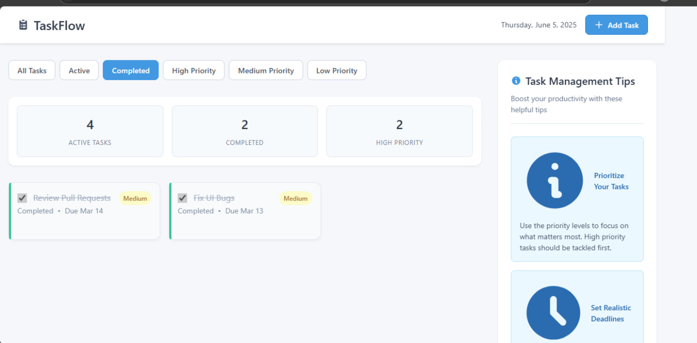
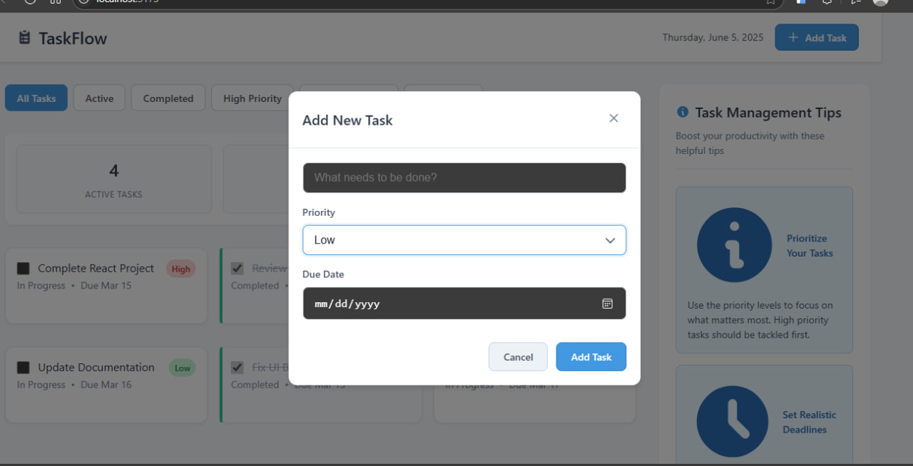
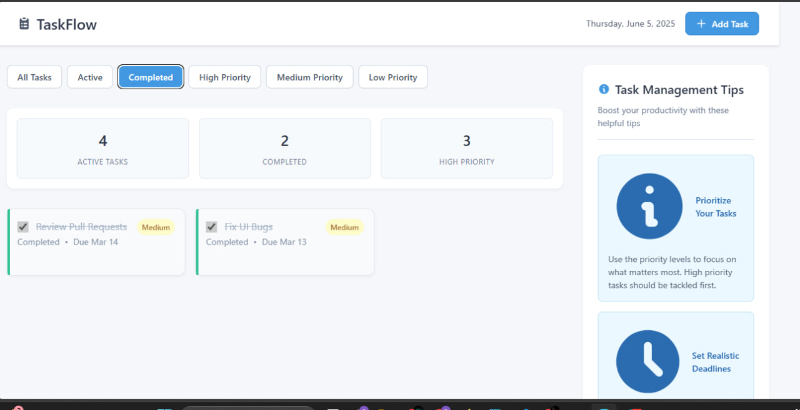
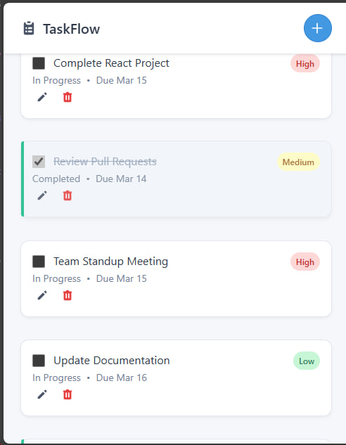

# TaskFlow - Task Management Application

[](https://your-deployed-url.com)

A modern, user-friendly task management application built with React and CSS. TaskFlow helps you organize your tasks efficiently with features like priority levels, due dates, and task filtering.

## Live Demo

Check out the live application: [TaskFlow Demo](https://frontend-kuraz-assessment.vercel.app/)

## Features

- Create, edit, and delete tasks
- Set task priorities (High, Medium, Low)
- Add due dates to tasks
- Mark tasks as complete/incomplete
- Filter tasks by status and priority
- Responsive design for all devices
- Task statistics dashboard
- Form validation for better user experience

## Screenshots

### Main Dashboard


_The main dashboard showing active tasks, task statistics, and filtering options_

### Task Creation


_Modal for creating new tasks with priority and due date selection_

### Task Management


_View of tasks with different priorities and completion statuses_

### Mobile View


_Responsive design on mobile devices_

## Getting Started

### Prerequisites

- Node.js (v14.0.0 or higher)
- npm (v6.0.0 or higher)

### Installation

1. Clone the repository:

```bash
git clone https://github.com/yourusername/taskflow.git
cd taskflow
```

2. Install dependencies:

```bash
npm install
```

3. Start the development server:

```bash
npm run dev
```

4. Open your browser and navigate to `http://localhost:5173`

## Usage

### Adding a Task

1. Click the "+" button in the navigation bar
2. Fill in the task details:
   - Title (required, 3-50 characters)
   - Priority (High, Medium, Low)
   - Due Date (required)
3. Click "Add Task" to save

### Managing Tasks

- Click the checkbox to mark a task as complete
- Use the edit button (pencil icon) to modify a task
- Use the delete button (trash icon) to remove a task
- Use the filter tabs to view tasks by status or priority

### Task Statistics

The dashboard shows:

- Total number of tasks
- Completed tasks
- Pending tasks
- Tasks by priority level

## Project Structure

```
taskflow/
├── src/
│   ├── components/
│   │   └── Task.jsx
│   ├── App.jsx
│   ├── App.css
│   └── main.jsx
├── public/
├── index.html
├── package.json
└── README.md
```
